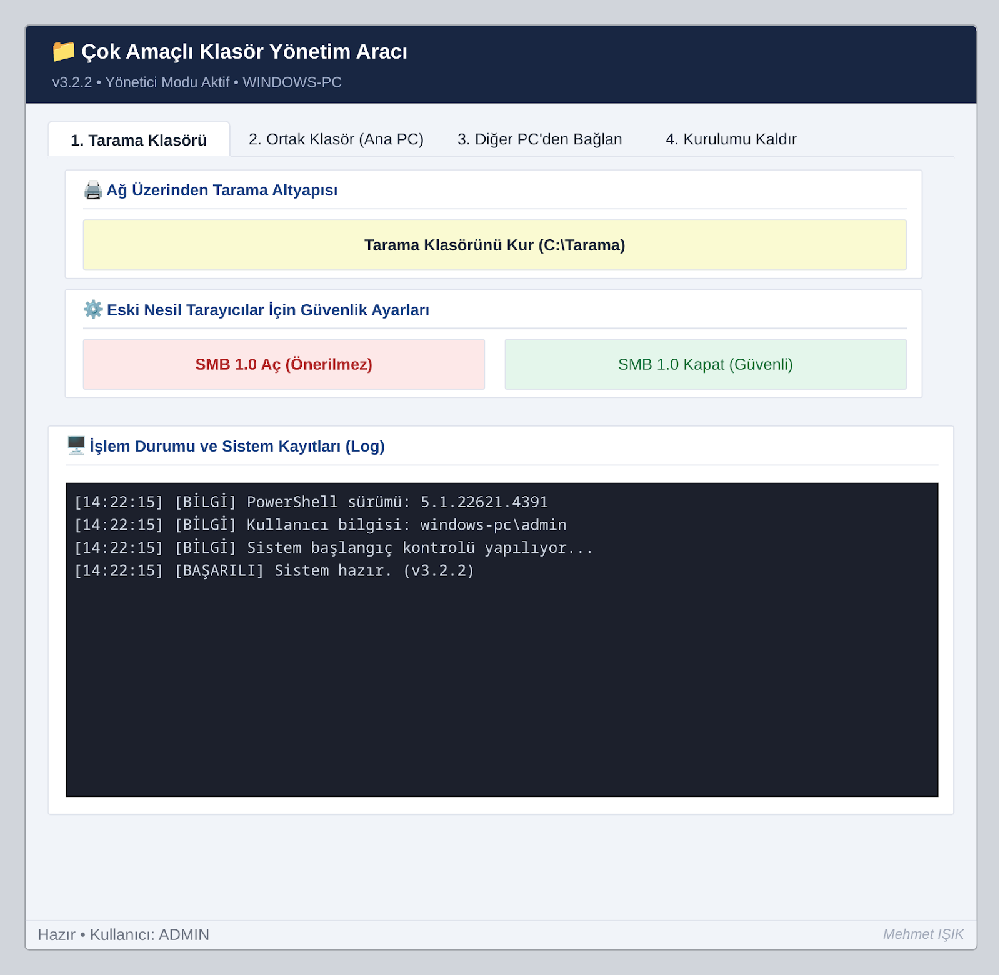

# 📁 Çok Amaçlı Klasör Yönetim Aracı

**v3.2.2** — Windows ağlarında tarama klasörü ve ortak paylaşım altyapısını tek bir arayüzden kurup yöneten PowerShell (WinForms) aracı.

<p align="center">
  
</p>

<p align="center">
  <a href="https://mhmtsk44.github.io/Klasor-Yonetim-Araci/"><b>🔗 Canlı, tıklanabilir önizlemeyi aç</b></a>
  <br>
  <sub>Yukarıdaki görsel statiktir; arayüz tepkilerini test etmek için canlı önizlemeyi kullanın.</sub>
</p>

---

## ✨ Özellikler

- **Tarama Klasörü** — Ağdaki yazıcı/fotokopi makinelerinin tarayabileceği, gizli (`Tarama$`) bir SMB paylaşımını tek tıkla kurar. Gerekli güvenlik duvarı kurallarını, ACL izinlerini ve uyku modu ayarlarını otomatik yapılandırır.
- **Ortak Klasör (Host)** — Ayrı, sınırlı yetkili bir `OrtakErisim` kullanıcı hesabıyla güvenli bir dosya paylaşım havuzu (`C:\OrtakHavuz`) oluşturur.
- **Diğer PC'den Bağlan** — Ağdaki host bilgisayara, kimlik bilgilerini Windows Kimlik Bilgisi Yöneticisi'ne kaydederek güvenli şekilde bağlanır.
- **Kurulumu Kaldır** — Seçmeli veya tam temizlik: paylaşımları, hesabı, masaüstü kısayollarını ve değiştirilen sistem ayarlarını (güç profili, güvenlik duvarı kuralları) orijinal haline geri döndürür.
- **Kriptografik Şifre Üretici** — `System.Security.Cryptography.RandomNumberGenerator` ve Fisher-Yates karıştırma ile güçlü, tahmin edilemez şifreler üretir.
- **Modern Arayüz ve Uyum** — "Segoe UI Emoji" fontu ve UTF-8 (BOM) kodlaması ile Windows 10/11 üzerinde tam renkli, sorunsuz emoji/simge gösterimi sunar. Eski JIT çizim hatalarından (`op_Subtraction`) arındırılmıştır.
- **Kalıcı Loglama** — Tüm işlemler zaman damgalı olarak hem uygulama içi konsolda hem de `%ProgramData%\KlasorYonetim\Program.log` dosyasında tutulur.
- **Otomatik Yönetici Yükseltme** — Tek dosyalık, bağımlılıksız `.ps1` betiği, yönetici yetkisi eksikse kendini otomatik olarak yeniden başlatır.

## 🖥️ Gereksinimler

- Windows 10/11 veya Windows Server (SMB ve `NetSecurity` modüllerinin bulunduğu bir sürüm)
- PowerShell 5.1 veya üzeri
- Yönetici yetkisi

## 🚀 Kullanım

```powershell
# Depoyu klonlayın veya dosyayı indirin, ardından terminalde çalıştırın:
powershell -ExecutionPolicy Bypass -File .\Klasor_Yonetim_Araci_v3.2.2.ps1
